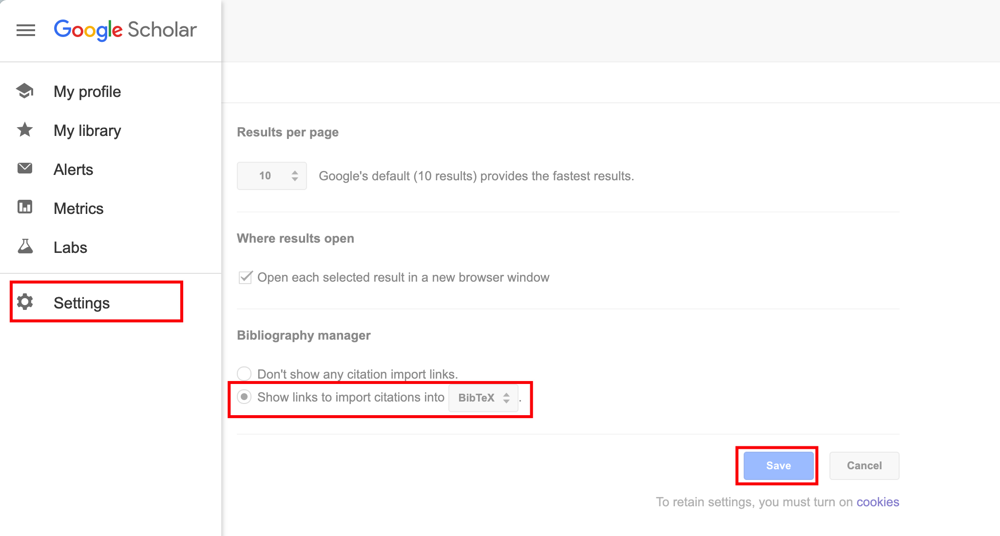
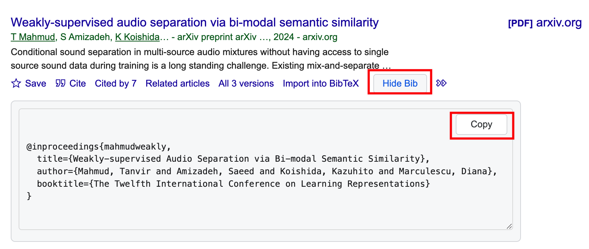

# Scholar Show BibTeX + Copy

A Tampermonkey userscript for Google Scholar that adds a `Show Bib` button next to `Import into BibTeX`, displays BibTeX inline, and lets you copy it with one click.

**Greasy Fork:** [Install / View Script](https://greasyfork.org/zh-CN/scripts/568950-scholar-show-bibtex-copy)

## Features

- Adds `Show Bib` directly beside `Import into BibTeX` for each result.
- Opens an inline BibTeX panel under the result (`Show Bib` / `Hide Bib`).
- Places a compact `Copy` button inside the BibTeX box (top-right).
- Prefers formally published BibTeX entries when available in `All N versions`.
- Falls back to the original BibTeX if no formal publication entry is found.

## Preview

### 1) Google Scholar setup (first time only)

Enable `Show links to import citations into BibTeX` in Scholar settings.

### 2) Inline BibTeX panel

## Installation

1. Install [Tampermonkey](https://www.tampermonkey.net/).
2. Quick install from Greasy Fork: [Scholar Show BibTeX + Copy](https://greasyfork.org/zh-CN/scripts/568950-scholar-show-bibtex-copy).
3. Or create a new userscript and paste `scholar-show-bibtex.user.js` manually.
4. Save and enable the script.
5. Open `https://scholar.google.com/`.

## Usage

1. On a Google Scholar results page, click `Show Bib`.
2. The script fetches and displays BibTeX below the item.
3. Click `Copy` to copy BibTeX to clipboard.

## BibTeX Selection Strategy

The script uses this priority:

1. Fetch the default BibTeX for the current result.
2. If it looks like a preprint (e.g., arXiv), inspect `All N versions`.
3. Try candidate BibTeX entries from versions and prefer a formal venue (`journal` / `booktitle`).
4. If no better candidate is found, keep the original BibTeX.

## FAQ

### Why don't I see `Import into BibTeX` in Google Scholar?
Enable it in Scholar settings:
`Settings` -> `Bibliography manager` -> `Show links to import citations into` -> `BibTeX`.

### Why does `Show Bib` not appear for some items?
Some entries may not expose citation links, or Scholar may render blocks asynchronously. Refresh the page and try again.

### Why is the BibTeX still an arXiv/preprint entry?
For some papers, Scholar versions do not provide a formal published BibTeX. In that case, the script intentionally falls back to the original one.

### Will this break if Google Scholar changes its HTML?
Possibly. This script relies on Scholar DOM structure and may need selector updates after major UI changes.

## License

This project is licensed under the Apache License 2.0.
See [`LICENSE`](./LICENSE) for details.
